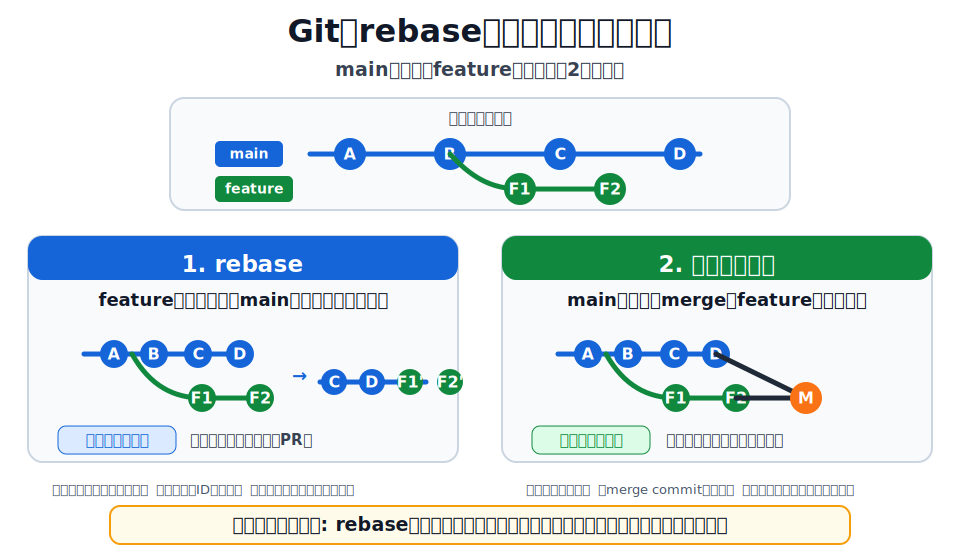

# ブランチ操作

ブランチの作成・切り替え・統合・一時退避に関するコマンドです。

## ブランチを確認する

`安全`

### いつ使う

ローカルやリモートにあるブランチを確認したいとき。

### コマンド例

```sh
# ローカルブランチ一覧。カレントブランチには * が付く
git branch

# リモートブランチ一覧
git branch -r

# ローカルとリモートをまとめて確認
git branch -a
```

### 注意点

一覧を見るだけなので安全です。作業前に今いるブランチを確認すると、別ブランチで作業してしまう事故を防げます。

### 戻し方があるか

確認だけなので戻し方は不要です。

## ブランチを切り替える

`安全`

### いつ使う

別のブランチに移動したいとき。

### コマンド例

```sh
git switch <branch>
```

### 注意点

未commitの変更があると切り替えできないことがあります。その場合はcommitするか、`git stash -u` で退避します。

### 戻し方があるか

元のブランチに戻るだけなら次を使います。

```sh
git switch -
```

## ブランチを作成して切り替える

`安全`

### いつ使う

新しい作業用ブランチを作り、そのまま移動したいとき。

### コマンド例

```sh
git switch -c feature/add-login
```

### 注意点

ブランチ名はチームのルールに合わせます。例: `feature/...`, `fix/...`, `docs/...`。

### 戻し方があるか

不要なブランチは削除できます。

```sh
git branch -d feature/add-login
```

## checkout と switch の違い

`安全`

### いつ使う

古い記事や既存メモに `git checkout` が出てきたとき、何をしているか判断したいとき。

### コマンド例

```sh
# ブランチ切り替え。今は switch が読みやすい
git switch main

# 古い書き方では checkout が使われる
git checkout main

# ファイル復元。今は restore が読みやすい
git restore <file>

# 古い書き方では checkout が使われる
git checkout -- <file>
```

### 注意点

`git checkout` は、ブランチ切り替えとファイル復元の両方に使われます。そのため、次の使い分けを基本にします。

| やりたいこと | 推奨 |
| ------------ | ---- |
| ブランチを移動する | `git switch` |
| ファイルを戻す | `git restore` |
| 古い記事・特殊な操作を読む | `git checkout` の意味を確認する |

### 戻し方があるか

ブランチ移動は `git switch -` で戻れます。ファイル復元は変更を消す操作なので、実行前に `git diff` で確認します。

## mainブランチの変更を作業ブランチへ取り込む

`注意`

### いつ使う

作業ブランチにmainの最新変更を取り込み、コンフリクトを早めに解消したいとき。

### コマンド例

ローカルのmainを更新してからmergeする方法:

```sh
git switch main
git pull --ff-only origin main
git switch feature/xxxxx
git merge main
git push origin feature/xxxxx
```

`origin/main` を直接mergeする方法:

```sh
git fetch origin
git switch feature/xxxxx
git merge origin/main
git push origin feature/xxxxx
```

### 注意点

このように、mainなどのベースブランチの変更を作業ブランチへ取り込むことを、現場では「バックマージ」と呼ぶことがあります。Git公式コマンド名ではなく、実際には作業ブランチ上で `main` や `origin/main` を `merge` する操作です。

`origin/main` を直接mergeする方法は、ローカルの `main` に切り替えて更新する必要がありません。今いるブランチと取り込み元が分かりやすいので、作業ブランチでの取り込みにはこの形も使いやすいです。

共有中の作業ブランチでは、履歴を書き換えない `merge` が扱いやすいです。チームでrebase運用をしている場合だけ `rebase` を選びます。

### 戻し方があるか

merge commitを作った後に取り消す場合は、履歴を残す `git revert -m 1 <merge-commit>` を検討します。

## バックマージと rebase の違い

`注意`

### いつ使う

mainの最新変更を作業ブランチへ取り込みたいが、`merge` と `rebase` のどちらを使うか迷ったとき。



### コマンド例

```sh
# バックマージ: mainの変更を作業ブランチへmergeする
git switch main
git pull --ff-only origin main
git switch feature/xxxxx
git merge main

# ローカルmainを更新せず、origin/mainを直接mergeする
git fetch origin
git switch feature/xxxxx
git merge origin/main

# rebase: 作業ブランチのcommitをorigin/mainの上に載せ直す
git fetch origin
git switch feature/xxxxx
git rebase origin/main
```

### 注意点

| 観点 | バックマージ | rebase |
| ---- | ------------ | ------ |
| 実際のGit操作 | `git merge main` | `git rebase origin/main` |
| 履歴 | merge commitができることがある | 作業commitが作り直される |
| 共有ブランチ | 使いやすい | 原則避ける |
| 個人の作業ブランチ | 安全寄り | 履歴をきれいにしやすい |
| コンフリクト解消 | まとめて解消しやすい | commitごとに解消することがある |
| push済みの場合 | そのままpushしやすい | force pushが必要になることがある |

基本の使い分け:

| 状況 | おすすめ |
| ---- | -------- |
| 複数人で使っている作業ブランチ | バックマージ |
| PRレビュー中で他人も見ているブランチ | バックマージ |
| まだ自分だけのローカル作業 | rebaseも可 |
| commit履歴をきれいにしてからPRを出したい | rebaseも可 |
| チームルールがmerge運用 | バックマージ |
| チームルールがrebase運用 | rebase |

`rebase` は履歴を書き換える操作です。push済みの作業ブランチでrebaseした場合、`git push --force-with-lease` が必要になることがあります。共有ブランチでは、他人の作業を壊す可能性があるため慎重に扱います。

### 戻し方があるか

merge中なら次で中止できます。

```sh
git merge --abort
```

rebase中なら次で中止できます。

```sh
git rebase --abort
```

merge commitを作った後に取り消すなら `git revert -m 1 <merge-commit>`、rebase後に戻すなら `git reflog` でrebase前のcommitを探します。

## rebase で履歴を直線にする

`注意`

### いつ使う

自分の作業ブランチのcommitを、最新のmainの上に載せ直したいとき。

### コマンド例

```sh
git fetch origin
git switch feature/xxxxx
git rebase origin/main
```

### 注意点

rebaseはcommit履歴を書き換えます。すでに他人が使っている共有ブランチでは原則避けます。

### 戻し方があるか

rebase中なら次で中止できます。

```sh
git rebase --abort
```

rebase後に戻したい場合は `git reflog` でrebase前のcommitを探します。

## 作業中の変更を一時退避する

`注意`

### いつ使う

未commitの変更を一時的に横へ置いて、別ブランチへ移動したいとき。

### コマンド例

```sh
# 退避した作業の一覧を確認
git stash list

# 追跡していないファイルも含めて退避
git stash -u

# 退避した作業を戻す
git stash apply 'stash@{0}'

# 退避した作業を戻して、stash一覧から消す
git stash pop 'stash@{0}'

# 退避した作業を消す
git stash drop 'stash@{0}'
```

### 注意点

`apply` はstashを残します。`pop` は戻したあとstashを消します。慣れるまでは `apply` を使う方が安心です。

### 戻し方があるか

`stash drop` で消す前なら `git stash list` から再適用できます。

## ローカルブランチをまとめて削除する

`危険`

### いつ使う

不要なローカルブランチを整理したいとき。

### コマンド例

```sh
# 削除候補を確認
git branch --merged main

# origin/mainを基準に確認
git fetch origin
git branch --merged origin/main

# 1つずつ削除
git branch -d <branch>
```

どうしてもまとめて削除したい場合:

```sh
# まず候補を見る
git branch --merged main | grep -vE '^\*|main|develop'

# 問題なければ削除
git branch --merged main | grep -vE '^\*|main|develop' | xargs -n 1 git branch -d
```

### 注意点

一括削除は、削除対象を必ず確認してから実行します。`git branch | grep -v "main" | xargs git branch -d` のような書き方は、`main` 以外の保護したいブランチも対象になりやすいため、ここでは推奨しません。

`git branch --merged main` は、mainへmerge済みのローカルブランチを確認するためのコマンドです。`develop` や `release/*` など、残したいブランチがある場合は削除対象から外します。

`git branch --merged main` はローカルの `main` を基準にします。削除候補を確認する前に、必要なら `git switch main` と `git pull --ff-only origin main` でローカルの `main` を最新化します。ローカルの `main` を切り替えたくない場合は、`git fetch origin` のあとに `git branch --merged origin/main` で確認します。

Windows標準のPowerShellでは `grep` や `xargs` が使えない場合があります。

PowerShellで確認しながら削除する場合の例:

```sh
git branch
git branch -d <branch>
```

### 戻し方があるか

削除したブランチの先端commitが分かる場合は復元できます。分からない場合は `git reflog` から探します。

## 参考

- [Git公式 git-branch](https://git-scm.com/docs/git-branch)
- [Git公式 git-switch](https://git-scm.com/docs/git-switch)
- [Git公式 git-checkout](https://git-scm.com/docs/git-checkout)
- [Git公式 git-merge](https://git-scm.com/docs/git-merge)
- [Git公式 git-rebase](https://git-scm.com/docs/git-rebase)
- [Git公式 git-stash](https://git-scm.com/docs/git-stash)
- [Git公式 git-remote](https://git-scm.com/docs/git-remote)
